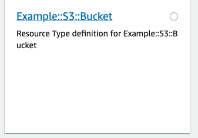

# Example::S3::Bucket

Table of contents
* [General info](#general-info)
* [Screenshots](#screenshots)
* [Technologies](#technologies)
* [Setup](#setup)
* [Deploy](#deploy)
* [Schema](#schema)

## General info
The following example creates a bucket with the name specified in the cloudformation template. You must specify a globally unique name for the bucket.

## Screenshots


## Technologies
* [CloudFormation CLI](https://github.com/aws-cloudformation/cloudformation-cli)
* [CloudFormation CLI Go plugin](https://github.com/aws-cloudformation/cloudformation-cli-go-plugin)
* [AWS Go SDK](https://aws.amazon.com/sdk-for-go/)

## Setup
Clone the repo and run `make` to build.
```
$ make
```
The RPDK will automatically generate the correct resource model from the schema whenever the project is built via Make. You can also do this manually with the following command: `cfn-cli generate`

**Note**: Please don't modify files `model.go and main.go`, as they will be automatically overwritten.

## Deploy
To register the provider run:
```
$ cfn submit -v

```

Then use the AWS console or CLI and deploy the `sample-resource.json` template.

## Schema
This example uses the official AWS S3 bucket schema for simplicity and to illustrate how to expand upon an existing AWS resource schema. The following properties are required:

| Name | Description | Required |
|:-----|:------------|:---------|
| Name | BucketName | ✅ |
